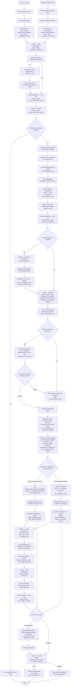

```mermaid
graph TD
    %% Self Signup Flow
    SelfSignupStart("User Self Signup")
    SelfSignup["User visits /signup form"]
    ShowSignup["Show /signup page"]
    SelfAPICall["POST /account-setup/signup<br/>web-bff receives request<br/>Input: (email, workspace_id: null)"]

    %% Workspace Invite Flow
    InviteStart("Workspace Admin Invite")
    Invite["Admin creates workspace invite"]
    ShowInvite["Show workspace invite form"]
    InviteAPICall["POST /account-setup/signup<br/>web-bff receives request<br/>Input: (email, workspace_id: required)"]

    %% Combined Setup Flow
    SetupSvcCall["web-bff → setup microservice<br/>Input: (email, workspace_id: optional)"]
    SetupCheckEmail["setup microservice:<br/>Check if email confirmed"]
    SetupGenCode["setup microservice:<br/>Generate new activation_code"]
    SetupSendEmail["setup microservice:<br/>Send activation_code via email"]
    SetupReturn1["setup microservice → web-bff<br/>Output: (status, email_confirmation_status)"]
    BFFtoFE1["web-bff → frontend<br/>Output: (status, email_confirmation_status)"]

    %% Frontend Response Flow
    FEStatus{"Frontend: email already activated?"}
    ShowLoginDialog["Show dialog with link to /login"]
    ShowCheckEmail["Show 'Check your email for activation link' message"]
    ToCheckEmail["Direct user to check email for activation link"]

    %% Activation Flow
    UserClicksLink["User clicks activation link<br/>(/setup?code=activation_code)"]
    ShowSetup["Show /setup page (validating activation_code)"]
    ValidateSvcCall["POST /account-setup/confirm<br/>web-bff → setup microservice<br/>Input: activation_code"]
    SetupActivate["setup microservice:<br/>Activate email, validate activation_code"]
    SetupReturn2["setup microservice → web-bff<br/>Output: (status, email, workspace_id: optional)"]

    %% Workspace Lookup Flow
    LookupWorkspace{"Was workspace_id provided?"}
    WorkspaceSvcCall["web-bff → workspace microservice<br/>Input: workspace_id"]
    WorkspaceLookup["workspace microservice:<br/>Get workspace details"]
    WorkspaceReturn["workspace microservice → web-bff<br/>Output: (workspace_name, workspace_icon_file_tag)"]
    BFFtoFE2["web-bff → frontend<br/>Output: (status, email, workspace_id: optional, workspace_name: optional, workspace_icon_file_tag: optional)"]

    %% User Input Flow
    ShowWelcomeDialog["Show welcome dialog:<br/>email confirmed, ask for first_name and last_name"]
    WorkspaceChoice{"Was user invited to a workspace?"}
    ShowWorkspaceConfirm["Show dialog to confirm joining workspace<br/>(show workspace_name and workspace_icon_file_tag)"]
    ShowWorkspaceCreate["Show dialog to create new workspace<br/>(enter new_workspace_name)"]
    WorkspaceDecision{"User confirms or rejects workspace invite?"}
    ShowPasswordDialog["Show password entry dialog"]
    CollectDetails["Collect first_name, last_name, email, password,<br/>workspace_id: optional (if joining), new_workspace_name: optional (if creating)"]

    %% Final Processing Flow with Diversion Logic
    FinalAPICall["POST /user-setup/complete<br/>web-bff receives all details<br/>Input: (first_name, last_name, email, password,<br/>workspace_id: optional OR new_workspace_name: optional)"]

    WorkspaceDecisionLogic{"Creating new workspace or joining existing?"}

    %% Existing Workspace Path
    WorkspaceConfirm["GET /workspaces/{workspace_id}/validate<br/>web-bff → workspace microservice<br/>Input: workspace_id"]
    WorkspaceValidate["workspace microservice:<br/>Validate workspace exists"]
    WorkspaceConfirmReturn["workspace microservice → web-bff<br/>Output: (validation_status, error_details: optional)"]

    %% New Workspace Path
    WorkspaceCreate["POST /workspaces<br/>web-bff → workspace microservice<br/>Input: new_workspace_name"]
    WorkspaceCreateProcess["workspace microservice:<br/>Create new workspace"]
    WorkspaceCreateReturn["workspace microservice → web-bff<br/>Output: (new_workspace_id, status, error_details: optional)"]

    %% Human Service
    HumanSvcCall["web-bff → human microservice<br/>Input: (first_name, last_name, email, workspace_id)"]
    HumanStore["human microservice:<br/>Store personal details and workspace association"]
    HumanReturn["human microservice → web-bff<br/>Output: (human_id, status, error_details: optional)"]

    %% Auth Service
    AuthSvcCall["web-bff → auth microservice<br/>Input: (password, human_id)"]
    AuthStore["auth microservice:<br/>Store password with human reference"]
    AuthReturn["auth microservice → web-bff<br/>Output: (status, error_details: optional)"]

    %% Error Handling and Rollback
    ErrorCheck{"Any errors occurred?"}
    RollbackProcess["web-bff initiates rollback:<br/>- Delete created workspace (if applicable)<br/>- Delete human record<br/>- Delete auth record"]
    RollbackComplete["Rollback completed"]

    %% Final Status
    FinalStatus["web-bff → frontend<br/>Output: (success_or_error_status, error_details: optional)"]
    ShowError["Show error dialog with error_details<br/>(user setup rolled back)"]
    ShowPlatformWelcome["Show welcome dialog and forward to dashboard"]
    End["End"]

    %% Flow Connections
    %% Self Signup Path
    SelfSignupStart --> SelfSignup
    SelfSignup --> ShowSignup
    ShowSignup --> SelfAPICall

    %% Workspace Invite Path
    InviteStart --> Invite
    Invite --> ShowInvite
    ShowInvite --> InviteAPICall

    %% Combined Setup Flow
    SelfAPICall --> SetupSvcCall
    InviteAPICall --> SetupSvcCall
    SetupSvcCall --> SetupCheckEmail
    SetupCheckEmail -->|No| SetupGenCode
    SetupGenCode --> SetupSendEmail
    SetupSendEmail --> SetupReturn1
    SetupCheckEmail -->|Yes| SetupReturn1
    SetupReturn1 --> BFFtoFE1
    BFFtoFE1 --> FEStatus
    FEStatus -->|Yes| ShowLoginDialog
    ShowLoginDialog --> End
    FEStatus -->|No| ShowCheckEmail
    ShowCheckEmail --> ToCheckEmail

    %% Activation Flow
    ToCheckEmail --> UserClicksLink
    UserClicksLink --> ShowSetup
    ShowSetup --> ValidateSvcCall
    ValidateSvcCall --> SetupActivate
    SetupActivate --> SetupReturn2
    SetupReturn2 --> LookupWorkspace
    LookupWorkspace -->|Yes| WorkspaceSvcCall
    WorkspaceSvcCall --> WorkspaceLookup
    WorkspaceLookup --> WorkspaceReturn
    WorkspaceReturn --> BFFtoFE2
    LookupWorkspace -->|No| BFFtoFE2
    BFFtoFE2 --> ShowWelcomeDialog

    %% User Input Flow
    ShowWelcomeDialog --> WorkspaceChoice
    WorkspaceChoice -->|Yes| ShowWorkspaceConfirm
    WorkspaceChoice -->|No| ShowWorkspaceCreate
    ShowWorkspaceConfirm --> WorkspaceDecision
    WorkspaceDecision -->|Confirm| ShowPasswordDialog
    WorkspaceDecision -->|Reject| ShowWorkspaceCreate
    ShowWorkspaceCreate --> ShowPasswordDialog
    ShowPasswordDialog --> CollectDetails

    %% Final Processing Flow with Diversion
    CollectDetails --> FinalAPICall
    FinalAPICall --> WorkspaceDecisionLogic

    %% Existing Workspace Branch
    WorkspaceDecisionLogic -->|"Joining existing workspace"| WorkspaceConfirm
    WorkspaceConfirm --> WorkspaceValidate
    WorkspaceValidate --> WorkspaceConfirmReturn
    WorkspaceConfirmReturn --> HumanSvcCall

    %% New Workspace Branch
    WorkspaceDecisionLogic -->|"Creating new workspace"| WorkspaceCreate
    WorkspaceCreate --> WorkspaceCreateProcess
    WorkspaceCreateProcess --> WorkspaceCreateReturn
    WorkspaceCreateReturn --> HumanSvcCall

    %% Sequential Processing
    HumanSvcCall --> HumanStore
    HumanStore --> HumanReturn
    HumanReturn --> AuthSvcCall
    AuthSvcCall --> AuthStore
    AuthStore --> AuthReturn

    %% Error Checking and Rollback
    AuthReturn --> ErrorCheck
    WorkspaceConfirmReturn --> ErrorCheck
    WorkspaceCreateReturn --> ErrorCheck
    ErrorCheck -->|"Errors detected"| RollbackProcess
    RollbackProcess --> RollbackComplete
    RollbackComplete --> FinalStatus
    ErrorCheck -->|"No errors"| FinalStatus

    %% Final Results
    FinalStatus -->|Error| ShowError
    FinalStatus -->|Success| ShowPlatformWelcome
    ShowError --> End
    ShowPlatformWelcome --> End
```

```

```
